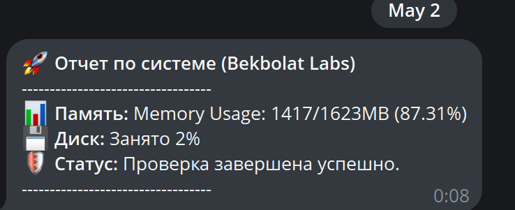

# Ansible System Health & Security Monitor

A lightweight automation tool designed to audit system resources and security configurations, delivering real-time reports via Telegram.

## 🚀 Features
- **Resource Monitoring:** Tracks RAM and Disk usage with percentage calculations.
- **Security Auditing:** Scans for world-writable files (777 permissions) to identify potential vulnerabilities.
- **Network Visibility:** Lists all active listening ports.
- **Instant Alerts:** Sends formatted Markdown reports directly to a Telegram bot.
## 📸 Example Output



## 🛠 Tech Stack
- **Infrastructure as Code:** Ansible
- **Target OS:** Linux (Ubuntu/WSL2)
- **API Integration:** Telegram Bot API
- **Configuration:** YAML

## ⚙️ Setup & Usage
1. **Prerequisites:** Ensure Ansible and `community.general` collection are installed.
2. **Configuration:** Create a `vars.yml` file (excluded via .gitignore) with your:
   - `tg_token`: Your Telegram Bot token
   - `tg_chat_id`: Your Telegram Chat ID
3. **Execution:**
   ```bash
   ansible-playbook telegram_report.yml
   ```

## 🔒 Security Note
This project follows security best practices by using variable files (`vars.yml`) for sensitive credentials, ensuring no tokens are exposed in the public repository.
